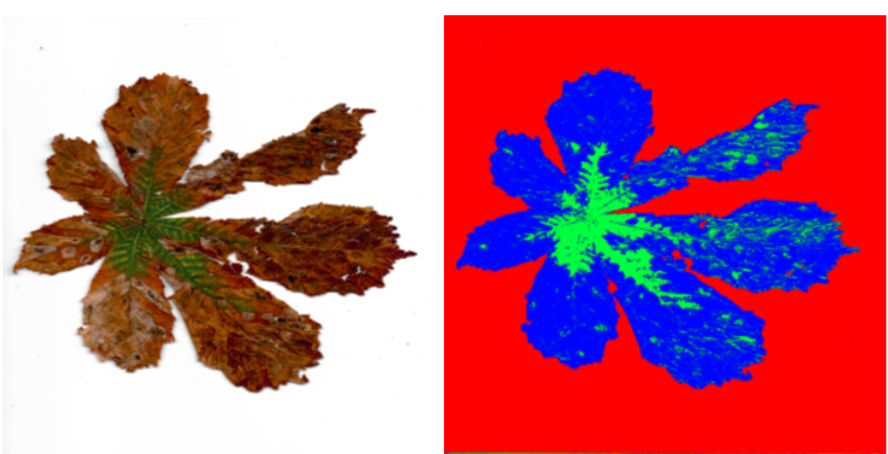
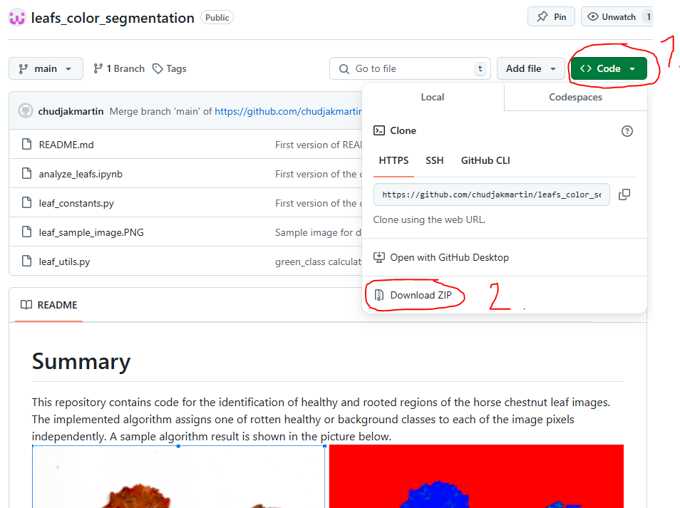
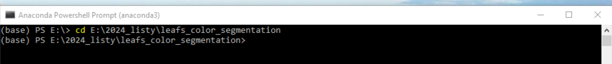
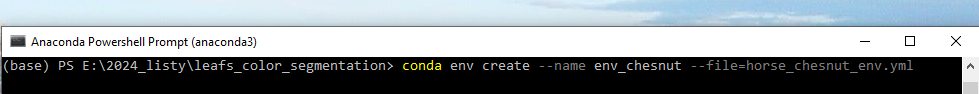
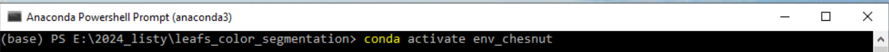
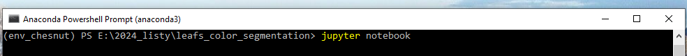

# Summary
This repository contains code for the identification of healthy and rooted regions of the horse chestnut leaf images. The implemented algorithm assigns one of the rotten, healthy, and background classes to each of the image pixels independently. A sample algorithm result is shown in the picture below.

Author of the code: [Martin Chudjak](https://github.com/chudjakmartin)

# Algorithm description
Each image is represented by the grid (matrix) of pixels. Each pixel is a RGB-triplet of numbers from the interval <0, 255>. Any color, represented by it’s RGB-triplet is a point in 3D Euclidean space. Therefore Euclidean distances between any two colors (each represented by it’s RGB-triplet) can be calculated and understood as a distance between these colors. 
We developed an algorithm for automatic segmentation of green and brown parts of a leaf. The algorithm is parametrized by the RGB base colors. Each of the base colors has it’s RGB-triplet and class. Base color classes are three: green leaf part, brown leaf part or background.
The algorithm works pixel-wise, meaning that for every pixel it performs the following steps:
-  calculates the distance of a pixel RGB-triplet to each of the base colors
-  selects, to which of the base colors the pixel is closest
-  assigns the class of the closest base color to the pixel
After assigning the class to every image pixel, the algorithm produces an image mask. An example of such mask can be seen in Figure in the summary. 
Note to code: For simplicity, color distances calculation is implemented using k-means algorithm. But we do not really use k-means algo to determine clusters centers, we define them by the base colors.

# Algorithm performance
Final method correctness verification is done by comparing the method’s performance against the experts’ results. The algorithm gave the same class or differed by one class in 75% of cases and differs by at most 2 classes in 93% of cases. This number is calculated by comparing the algorithm’s results with the class assigned by the 25 experts. Furthermore, to evaluate algorithm correctness, we compared the algorithm’s results pixel-wise to the leaf segmentation assigned by the expert, resulting in the 89% +- 4% overlap averaged over 10 images.

# Files content
- analyze_leafs.ipynb: main notebook for reading the images from your directory, predicting pixel classes, displaying the results, and generating the excel with statistics about each leaf.
- leaf_constants.py: Algorithm constants
    - colors: Base colors are specified here. Distances of pixel colors to each of these colors in RGB space are calculated and pixel classes are determined based on  which of the base colors it is closest to.
    - group_colors_to_display: Colors by which the pixels groups are displayed.
    - base_images_dir: Directory where source images are stored.
    - image_size_cm: Size of a leaf image in squared centimeters.
    - N_green_classes: Determines, how many classes, the order of roothing is split to.
- leaf_utils.py: Main functions
    - calculate_pixel_classes: Pixel classes are determined in this function.
    - calculate_image_statistics: Calculate image statistics.

# How to use

If you want to use the provided code for your own purposes, create conda enviroment from yaml file, or install them manually. Versions of the main libraries are the following:
- numpy=1.26.4
- pandas=2.2.1
- pillow=10.3.0
- pymupdf==1.24.5
- scipy=1.13.1

After installing the libraries, set constants in the leaf_constants.py file and you are ready to use. If you are new to python, you may follow the following instructions:
- Install Anaconda (see e.g. this [video](https://www.youtube.com/watch?v=UTqOXwAi1pE)).
- Download this repository. If you know how to use git, simply use git clone command. Otherwise, download this repository as zip file to your local directory and extract it.

- Open Anaconda Powershell Prompt (it was installed along Anaconda program) and change the directory to where you want to have your files and code, which analyze them. Use command cd your_dir_path. Type “cd E:/2024_listy/leafs_color_segmentation” and hit Enter as shown in the screenshot.

- Create Anaconda env from yaml file using commands below. This contains all python packages in the correct versions for the code to work properly.

- Activate newly-created environment.

- Type "jupyter notebook" to your conda power shell and you should be ready to use the code.

# Excel with leaf's statistics
Function calculate_image_statistics calculates statistics which are than exported to the excel file. Excel has the following columns
- filename: str: name of file
- green_ratio: float from [0, 1] - what part of the leaf is the green class assigned to.
- leaf_ratio: float from [0, 1] - what part of the image is leaf (i.e. pixels which are not the background).
- leaf_area_cm: Area of leaf in cm^2
